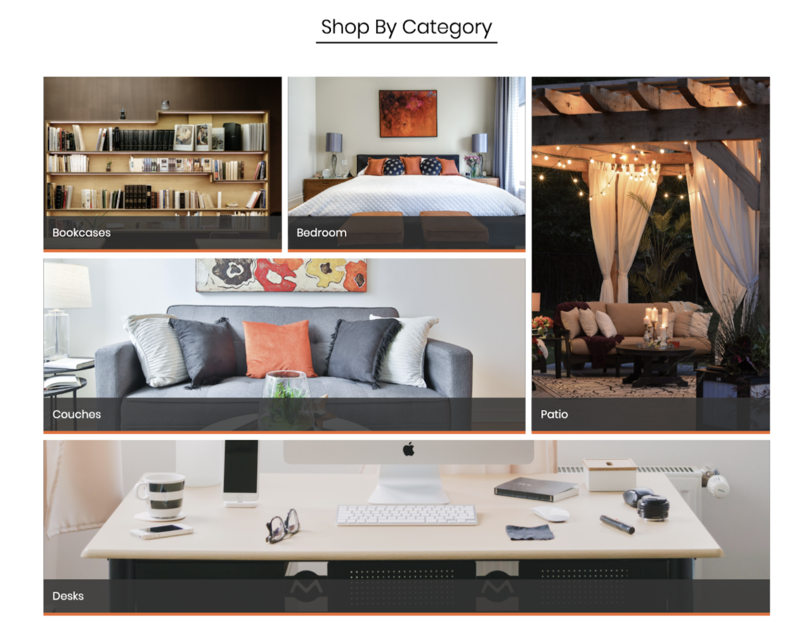
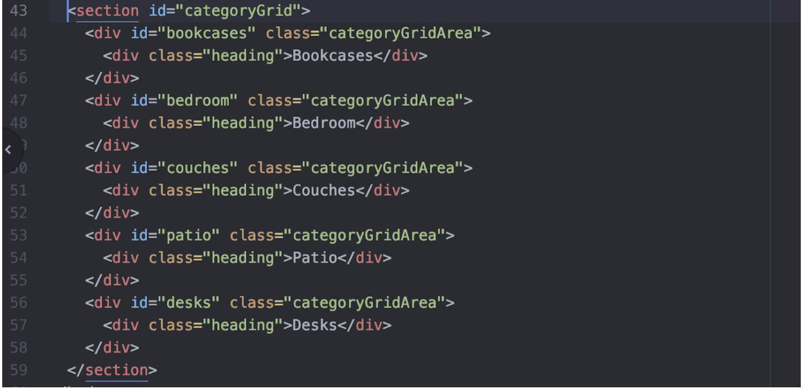
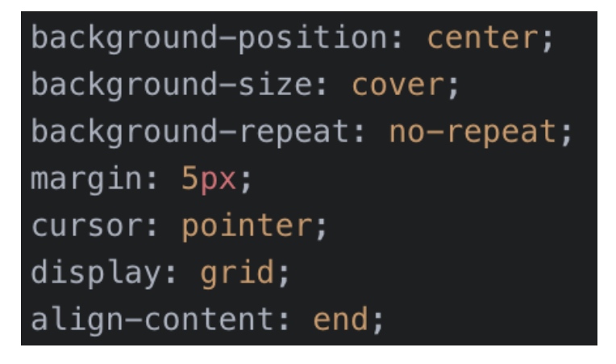
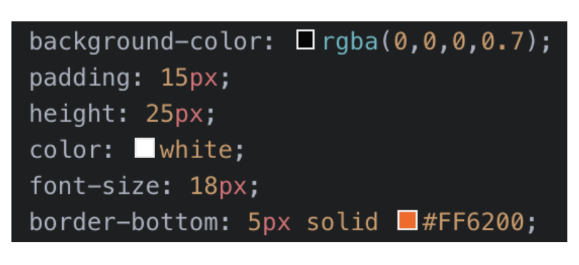

# CSS Grid and Breakpoints

CSS Grid can be used to build simple and skeletal layouts. It can also be used to create polished, professional-level layouts.

In this activity, you will use CSS Grid to re-create the design of an online furniture store.

## Instructions

### Part 2: Furniture Grid 

In this section, we will finish building the rest of the page!

  

* Before creating our second grid, add a `div` with the class `subHeading`.

Create an `h3` tag and add the text “Shop by Category” within this `div`.

* Next, create the HTML tags that will be our second grid under our first. Give the second grid the ID `categoryGrid`.

  * Hint: Use a `section` tag for your grid.

* Create the following HTML structure inside your newly created `section` tag. This is all the HTML structure you will need for your second grid.

  

* Next, open `style.css`.  

* Create a selector that targets the `subHeading` class. Add the following:

  

* Create a selector that targets your second grid using its ID.

* Add `margin: 0px 5%;` and `display: grid;` to create your grid.

* Use the `grid-template-rows`, `grid-template-columns`, and `grid-template-areas` properties to create the structure of the grid.

  * You will have three columns and three rows in this layout (note the illustration below).

  * Make your row `300px` tall.

  * Each column should occupy one-third of the area (use fractional units).

  * The area should look like the diagram below:

    

* Next, create `five selectors` that target each grid area you created in `index.html`. Remember to target the ID for each area.

* Add a `background-image` to each grid area selector using the images provided in the images folder.

* Create a selector for the common grid area class `categoryGridArea`.

* Add the following properties and values to this selector:

    

* Lastly, create a selector to target the `heading` class with the following:

    
	
* Now, open `index.html` in your browser and take a look at both grids. 

* You should notice that you’ve created a great-looking layout using nested grids!

Resources

* [grid-template-rows documentation](https://www.w3schools.com/cssref/pr_grid-template-rows.asp) 

* [grid-template-columns documentation](https://www.w3schools.com/cssref/pr_grid-template-columns.asp)

---

© 2023 edX Boot Camps LLC. Confidential and Proprietary. All Rights Reserved.
>>>>>>> 62c96332a3bf7036ee1a2eeb77877b7a2038c7cf
